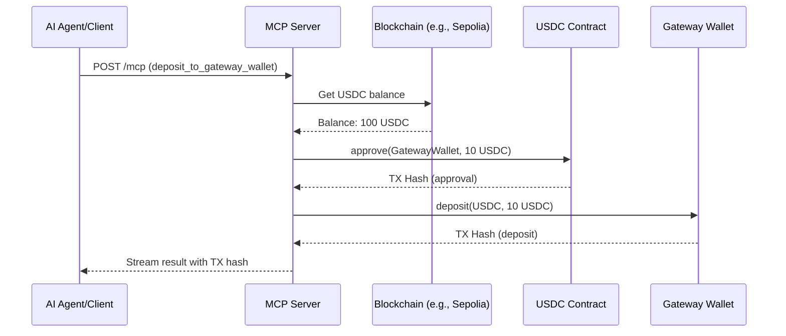
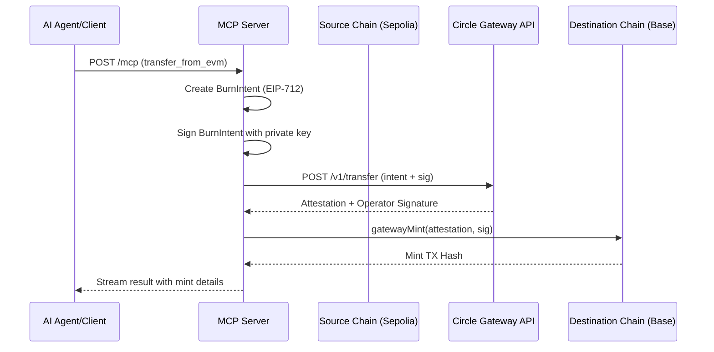

# mcpTools Directory Documentation

## Overview

The `mcpTools` directory implements a **Model Context Protocol (MCP) server** that exposes Circle's cross-chain USDC operations as callable tools. This allows AI agents and other MCP clients to interact with Circle's Gateway infrastructure for depositing, bridging, and transferring USDC across multiple EVM-compatible testnets.

## Architecture

```
mcpTools/
├── circleTools/           # Core functionality modules
│   ├── config.ts          # Chain configurations and constants
│   ├── balance.ts         # Query Gateway Wallet balances
│   ├── bridgeKit.ts       # Bridge USDC using Circle BridgeKit SDK
│   ├── deposit.ts         # Deposit USDC to Gateway Wallet
│   ├── transfer_from_evm.ts  # Cross-chain transfers with Gateway
│   ├── mcpServer.ts       # MCP server exposing tools via HTTP
│   └── streamableServer.ts   # (Commented out) Alternative Express implementation
└── testRun.ts             # Test client for MCP server
```

---

## Core Components

### 1. **config.ts** - Configuration Hub

**Purpose**: Centralizes all chain configurations, contract addresses, and account setup.

**Key Features**:
- **Account Setup**: Loads EVM private key from `process.env.EVM_EVM_PRIVATE_KEY` and creates a viem account
- **Gateway Addresses**:
  - `GATEWAY_WALLET_ADDRESS`: `0x0077777d7EBA4688BDeF3E311b846F25870A19B9`
  - `GATEWAY_MINTER_ADDRESS`: `0x0022222ABE238Cc2C7Bb1f21003F0a260052475B`

**Supported Chains** (8 testnets):
| Chain                 | Domain ID | USDC Address |
|-----------------------|-----------|--------------|
| Sepolia               | 0         | 0x1c7D4B196Cb0C7B01d743Fbc6116a902379C7238 |
| Base Sepolia          | 6         | 0x036CbD53842c5426634e7929541eC2318f3dCF7e |
| Avalanche Fuji        | 1         | 0x5425890298aed601595a70ab815c96711a31bc65 |
| Arc Testnet           | 26        | 0x3600000000000000000000000000000000000000 |
| Hyperliquid EVM Test  | 19        | 0x2B3370eE501B4a559b57D449569354196457D8Ab |
| Sei Testnet           | 16        | 0x4fCF1784B31630811181f670Aea7A7bEF803eaED |
| Sonic Testnet         | 13        | 0x0BA304580ee7c9a980CF72e55f5Ed2E9fd30Bc51 |
| Worldchain Sepolia    | 14        | 0x66145f38cBAC35Ca6F1Dfb4914dF98F1614aeA88 |

**Helper Functions**:
- `parseSelectedChains()`: Parses chain names from CLI args, supports "all" keyword

---

### 2. **balance.ts** - Balance Checker

**Purpose**: Queries Circle Gateway API for USDC balances across all supported chains.

**How It Works**:
1. Retrieves depositor address from environment private key
2. Constructs a POST request to `https://gateway-api-testnet.circle.com/v1/balances`
3. Requests balances for all 8 domain IDs
4. Returns formatted string with per-chain and total balances

**Example Output**:
```
sepolia: 10.500000 USDC
baseSepolia: 5.250000 USDC
avalancheFuji: 0.000000 USDC
...
Total: 15.750000 USDC
```

**API Call Structure**:
```json
{
  "token": "USDC",
  "sources": [
    {"domain": 0, "depositor": "0x..."},
    {"domain": 1, "depositor": "0x..."}
  ]
}
```

---

### 3. **bridgeKit.ts** - Circle BridgeKit Integration

**Purpose**: Uses Circle's official `@circle-fin/bridge-kit` SDK to bridge USDC between chains.

**Parameters**:
- `sourceChainName`: BridgeChainIdentifier (enum from Circle SDK)
- `destinationChainName`: BridgeChainIdentifier
- `amount`: String representation of USDC amount

**How It Works**:
1. Initializes `BridgeKit` instance
2. Creates a viem adapter from private key (`EVM_PRIVATE_KEY` env var)
3. Calls `kit.bridge()` with source/destination chains and amount
4. Returns formatted result with transaction details

**Note**: Uses `EVM_PRIVATE_KEY` env var (different from `EVM_EVM_PRIVATE_KEY` in config)

---

### 4. **deposit.ts** - Gateway Wallet Deposits

**Purpose**: Deposits USDC from user wallet into Circle's Gateway Wallet on specified chains.

**Process** (for each chain):
1. **Check Balance**: Verifies user has sufficient USDC
   - If insufficient: Returns error message with faucet link
2. **Approve**: Calls `USDC.approve(GATEWAY_WALLET_ADDRESS, amount)`
3. **Deposit**: Calls `GatewayWallet.deposit(USDC_ADDRESS, amount)`
4. Waits for transaction confirmations

**Gateway Wallet ABI**:
```solidity
function deposit(address token, uint256 value) external nonpayable
```

**Parameters**:
- `chains`: Array of chain names (or ["all"])
- `depositAmount`: bigint (USDC amount in wei, 6 decimals)

**Return**: Transaction hash for each successful deposit

---

### 5. **transfer_from_evm.ts** - Cross-Chain Transfer Engine

**Purpose**: Implements Circle's Gateway protocol for burning USDC on source chains and minting on destination chain.

**Complex Workflow**:

#### Phase 1: Create Burn Intents
For each source chain:
1. Creates a `BurnIntent` struct with:
   - Source/destination domain IDs
   - Gateway contract addresses
   - USDC token addresses
   - Depositor/recipient addresses
   - Transfer value
   - Random salt for uniqueness
   - `maxBlockHeight`: unlimited (maxUint256)
   - `maxFee`: 2.01 USDC

2. Signs using **EIP-712 typed data**:
   ```
   Domain: {name: "GatewayWallet", version: "1"}
   Types: EIP712Domain, TransferSpec, BurnIntent
   ```

#### Phase 2: Request Attestation
1. POSTs all burn intents + signatures to:
   `https://gateway-api-testnet.circle.com/v1/transfer`
2. Circle's Gateway API validates and returns:
   - `attestation`: Cryptographic proof of burn
   - `signature`: Operator signature

#### Phase 3: Mint on Destination
1. Creates wallet client for destination chain
2. Calls `GatewayMinter.gatewayMint(attestation, signature)`
3. Waits for mint transaction confirmation
4. Returns total minted amount and transaction hash

**Parameters**:
- `chains`: Source chains to burn from
- `destinationChain`: Chain to mint on
- `transferValue`: Amount in wei (6 decimals)
- `recipientAddress`: Destination wallet address

**Key Constants**:
- `MAX_FEE`: 2.01 USDC (2_010000n in wei)

**EIP-712 Types**:
- `TransferSpec`: 14 fields defining complete transfer specification
- `BurnIntent`: Wraps TransferSpec with maxBlockHeight and maxFee

---

### 6. **mcpServer.ts** - MCP Server Implementation

**Purpose**: Exposes all Circle operations as MCP tools via HTTP streaming.

**Server Configuration**:
```typescript
Server: McpServer
Name: "circle-tools-remote"
Version: "1.0.0"
Transport: StreamableHTTPServerTransport
Port: 3000
Endpoint: /mcp
```

**Registered Tools**:

#### Tool 1: `balance_of_gateway_wallet`
- **Description**: Get gateway wallet balance
- **Parameters**: None
- **Returns**: Formatted balance string across all chains
- **Features**: Sends progress notification before execution

#### Tool 2: `bridge_usdc`
- **Description**: Bridge USDC from EVM to EVM using Circle BridgeKit
- **Parameters**:
  - `sourceChainName`: Enum of BridgeChain
  - `destinationChainName`: Enum of BridgeChain
  - `amount`: String
- **Returns**: Bridge operation result (tx hash, status)

#### Tool 3: `deposit_to_gateway_wallet`
- **Description**: Deposit USDC to Circle Gateway Wallet
- **Parameters**:
  - `chains`: Array of chain names (enum)
  - `depositAmount`: String (wei representation)
- **Returns**: Deposit transaction details

#### Tool 4: `transfer_from_evm`
- **Description**: Transfer USDC cross-chain using Gateway protocol
- **Parameters**:
  - `chains`: Array of source chains
  - `destinationChain`: Destination chain enum
  - `amount`: String (wei)
  - `recipientAddress`: String (address)
- **Returns**: Mint transaction details

**HTTP Server**:
```typescript
- Method: POST
- URL: http://localhost:3000/mcp
- Headers:
  - Content-Type: application/json
  - mcp-session-id: <uuid>
- Request Format: JSON-RPC 2.0
```

**Session Management**:
- Uses `randomUUID()` for session ID generation
- Supports streaming responses via Server-Sent Events (SSE)

---

### 7. **testRun.ts** - Test Client

**Purpose**: Demonstrates how to call the MCP server with streaming support.

**Test Configuration**:
```typescript
URL: http://localhost:3000/mcp
Method: POST
Tool Called: balance_of_gateway_wallet
Session ID: 81f7323a-3cd9-40a3-b8e7-3f4082e2115d
```

**Streaming Implementation**:
1. Makes POST request with JSON-RPC 2.0 format:
   ```json
   {
     "jsonrpc": "2.0",
     "id": 1,
     "method": "tools/call",
     "params": {
       "name": "balance_of_gateway_wallet",
       "arguments": {}
     }
   }
   ```

2. Processes Server-Sent Events (SSE) stream:
   - Reads `TextDecoderStream` chunks
   - Parses `data: ` and `event: ` lines
   - Logs progress notifications and final result

3. **Output Format**:
   ```
   --- Stream Started ---
   📥 Received Event: { ... }
   🔔 Event Type: message
   ✅ Final result reached.
   --- Stream Closed ---
   ```

**Key Features**:
- Real-time progress tracking via SSE
- Graceful error handling for malformed JSON
- Detects final result completion

---

## Protocol Flow Examples

### Example 1: Check Balance
```
Client → MCP Server → Circle Gateway API
1. POST /mcp {"method": "tools/call", "params": {"name": "balance_of_gateway_wallet"}}
2. Server calls balanceOfGatewayWallet()
3. GET https://gateway-api-testnet.circle.com/v1/balances
4. Returns formatted balance string via SSE stream
```

### Example 2: Deposit USDC
```
Client → MCP Server → Blockchain
1. POST /mcp with deposit_to_gateway_wallet tool
2. For each chain:
   a. Check USDC balance (ERC20.balanceOf)
   b. Approve Gateway Wallet (ERC20.approve)
   c. Deposit (GatewayWallet.deposit)
3. Return transaction hashes
```

### Example 3: Cross-Chain Transfer
```
Client → MCP Server → Circle Gateway → Destination Chain
1. POST /mcp with transfer_from_evm tool
2. Create burn intents for each source chain
3. Sign with EIP-712 (GatewayWallet domain)
4. POST to Circle Gateway API /v1/transfer
5. Receive attestation + operator signature
6. Call GatewayMinter.gatewayMint on destination chain
7. Return mint transaction hash
```

---

## Environment Variables

Required environment variables:
```bash
transfer_from_evm)
EVM_PRIVATE_KEY=0x...         # Used by bridgeKit.ts (note: different var name)
```

---

## Dependencies

**Key Packages**:
- `@circle-fin/bridge-kit`: Official Circle SDK for bridging
- `@circle-fin/adapter-viem-v2`: Viem adapter for BridgeKit
- `@modelcontextprotocol/sdk`: MCP protocol implementation
- `viem`: Ethereum library for contract interactions
- `zod`: Schema validation for MCP tool inputs

---

## Security Considerations

1. **Private Keys**: Loaded from environment variables, never hardcoded
2. **EIP-712 Signing**: Structured data signing prevents replay attacks
3. **Salt Generation**: Unique random salt per burn intent
4. **Approval Pattern**: Follows ERC20 approve-then-transfer pattern
5. **Attestation Validation**: Circle Gateway API validates burn intents before minting
6. **Testnet Only**: All configurations point to testnet endpoints

---

## API Endpoints Used

### Circle Gateway Testnet API:
- **Balance Check**: `POST https://gateway-api-testnet.circle.com/v1/balances`
- **Transfer**: `POST https://gateway-api-testnet.circle.com/v1/transfer`
- **Faucet**: `https://faucet.circle.com`

### Local MCP Server:
- **Endpoint**: `http://localhost:3000/mcp`
- **Protocol**: JSON-RPC 2.0 over HTTP with SSE streaming

---

## Usage Patterns

### Starting the Server
```bash
# Set environment variables
export EVM_EVM_PRIVATE_KEY=0x...
export EVM_PRIVATE_KEY=0x...

# Run the MCP server
node mcpTools/circleTools/mcpServer.ts
# Server listens on port 3000
```

### Testing the Server
```bash
# Run test client
node mcpTools/testRun.ts
# Calls balance_of_gateway_wallet tool and streams results
```

### Calling from AI Agent
```typescript
// Example: Check balance
const response = await fetch("http://localhost:3000/mcp", {
  method: "POST",
  headers: {
    "Content-Type": "application/json",
    "mcp-session-id": crypto.randomUUID()
  },
  body: JSON.stringify({
    jsonrpc: "2.0",
    id: 1,
    method: "tools/call",
    params: {
      name: "balance_of_gateway_wallet",
      arguments: {}
    }
  })
});
```

---

## Transaction Flow: Deposit Example



---

## Transaction Flow: Cross-Chain Transfer Example



---

## Error Handling

**Common Errors**:
1. **Missing Private Key**: Throws error on server startup
2. **Insufficient Balance**: Returns faucet link in deposit.ts
3. **Invalid Chain Name**: Filtered by `parseSelectedChains()`
4. **Gateway API Errors**: HTTP status codes propagated to client
5. **Transaction Failures**: Caught and returned with error details

**Example Error Response**:
```json
{
  "jsonrpc": "2.0",
  "id": 1,
  "error": {
    "code": -32000,
    "message": "Gateway API error: 400 Invalid burn intent"
  }
}
```

---

## File Status

**Active Files**:
- config.ts ✅
- balance.ts ✅
- bridgeKit.ts ✅
- deposit.ts ✅
- transfer_from_evm.ts ✅
- mcpServer.ts ✅
- testRun.ts ✅ (Modified according to git status)

**Inactive Files**:
- streamableServer.ts ❌ (Fully commented out, legacy Express implementation)

---

## Key Differences

### BridgeKit vs Gateway Protocol

| Feature | BridgeKit (bridgeKit.ts) | Gateway Protocol (transfer_from_evm.ts) |
|---------|--------------------------|------------------------------------------|
| SDK | @circle-fin/bridge-kit | Manual viem + EIP-712 |
| Complexity | High-level abstraction | Low-level protocol implementation |
| Flexibility | Limited to BridgeKit chains | Full control over transfer specs |
| Use Case | Simple chain-to-chain | Complex multi-source transfers |
| Signing | Handled internally | Manual EIP-712 typed data signing |

---

## Future Improvements

1. **Error Recovery**: Add retry logic for failed transactions
2. **Gas Optimization**: Batch approvals for multiple deposits
3. **Monitoring**: Add logging/metrics for production
4. **Authentication**: Secure MCP endpoint with API keys
5. **Rate Limiting**: Prevent API abuse on public endpoints
6. **Multi-Recipient**: Support batch transfers to multiple addresses
7. **Transaction Tracking**: Store and query transaction history

---

## Summary

The `mcpTools` directory provides a complete MCP server implementation for Circle's USDC cross-chain operations. It abstracts complex blockchain interactions into simple tool calls, enabling AI agents to:
- Check USDC balances across 8 testnets
- Deposit USDC into Circle's Gateway Wallet
- Bridge USDC using Circle's official SDK
- Execute cross-chain transfers using Gateway protocol with EIP-712 signing

The architecture is modular, well-structured, and production-ready for testnet environments.
